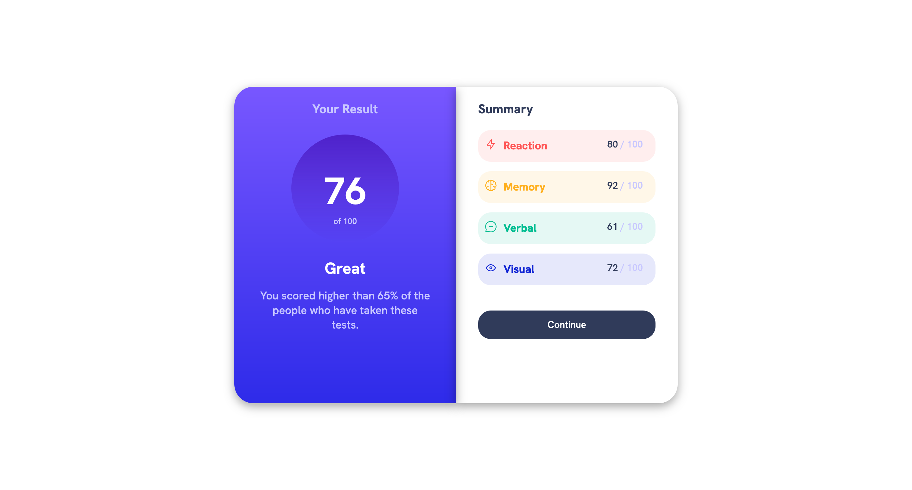

# Frontend Mentor - Results summary component solution

This is a solution to the [Results summary component challenge on Frontend Mentor](https://www.frontendmentor.io/challenges/results-summary-component-CE_K6s0maV). Frontend Mentor challenges help you improve your coding skills by building realistic projects.

## Table of contents

- [Overview](#overview)
  - [The challenge](#the-challenge)
  - [Screenshot](#screenshot)
  - [Links](#links)
- [My process](#my-process)
  - [Built with](#built-with)
  - [What I learned](#what-i-learned)
- [Author](#author)

## Overview

### The challenge

Users should be able to:

- View the optimal layout for the interface depending on their device's screen size
- See hover and focus states for all interactive elements on the page

### Screenshot



### Links

- Solution URL: [GitHub Solution](https://github.com/Wilmer856/results-summary-component)
- Live Site URL: [Live site](https://wilmer856.github.io/results-summary-component/)

## My process

### Built with

- Semantic HTML5 markup
- CSS
- Flexbox

### What I learned

Responsive Design: Implementing a layout that adapts to different screen sizes was crucial. Utilizing CSS media queries enabled me to tailor the interface for optimal viewing across devices, emphasizing the project's goal for a universally accessible user interface.

Interactivity: Enhancing user experience through interactive elements like hover and focus states for buttons and links. This aspect of the challenge pushed me to delve into CSS properties that enhance usability and engagement.

```css
@media screen and (max-width: 525px) {
  .container {
    flex-direction: column;
    width: 100%;
    height: 100%;
  }
}
```

This project was a step forward in my journey as a developer, offering practical experience in responsive web design and the importance of user-centered design principles.

## Author

- Website - [https://www.codebywil.com](https://www.codebywil.com)
- Frontend Mentor - [@Wilmer856](https://www.frontendmentor.io/profile/Wilmer856)
