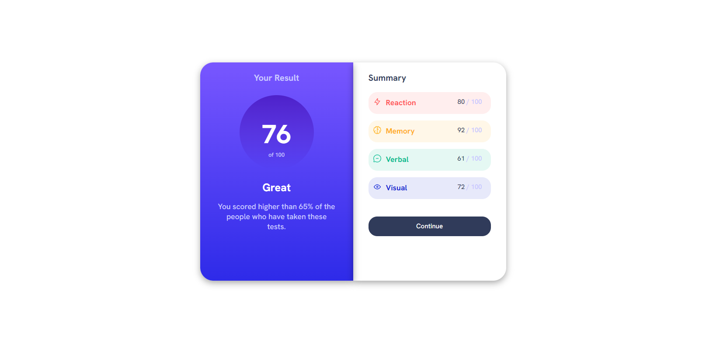
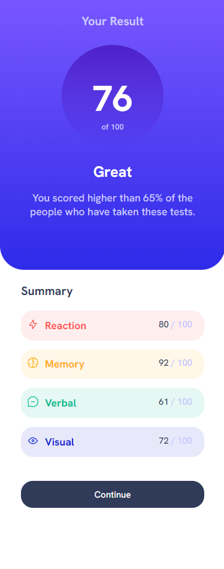

# Results Summary Component

## Overview

This project introduces a responsive and interactive Results Summary Component, crafted meticulously with HTML and CSS. It is designed to display users' scores in a visually engaging format, ideal for quizzes, assessments, or any form of test results presentation. The component incorporates Google Fonts for typography and includes various UI elements to represent scores and feedback effectively.

## Features

- **Responsive Layout:** Adapts to different device screens, ensuring accessibility and user-friendliness.
- **Custom Typography:** Utilizes 'Hanken Grotesk' from Google Fonts, offering a clean and modern look to the text elements.
- **Interactive UI Elements:** A "Continue" button for further actions, enhancing user engagement.
- **Detailed Results Display:** Showcases the main score within a circular graph and provides a summary of individual categories such as Reaction, Memory, Verbal, and Visual scores.

## Screenshots





## Setup

To use this component in your project, follow these steps:

1. **Clone the Repository:**

```bash
git clone https://github.com/Wilmer856/results-summary-component.git
```

2. **Navigate to the Project Directory:**

```bash
cd results-summary-component-main
```

3. **Open the `index.html` file in a web browser to view the component.**

## Customization

- **Score Data:** Update the HTML content to reflect the actual scores and feedback relevant to your application.
- **Images:** Swap out the images in the assets/images directory with your icons to match the test categories.
- **Styling:** Tailor the CSS in styles.css to align with your branding requirements, such as colors and font sizes.

## Dependencies

- Google Fonts: [Hanken Grotesk](https://fonts.google.com/specimen/Hanken+Grotesk) for typography.
